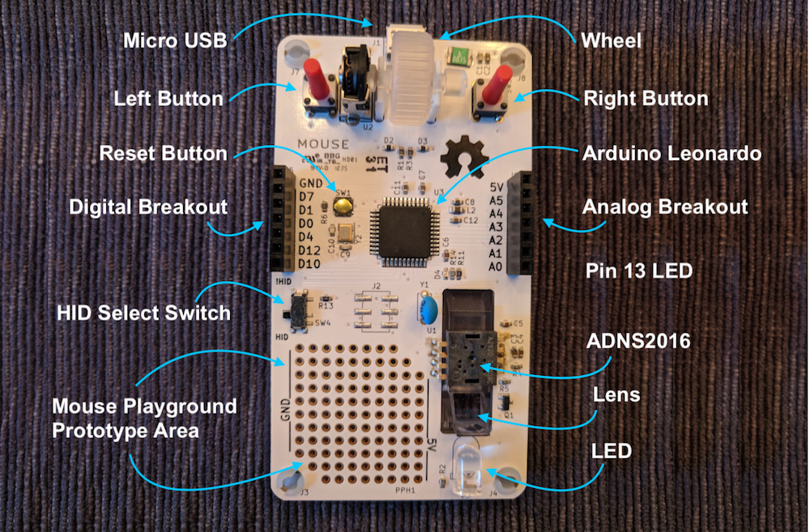

# Mouse

### Repository for Open Source Mouse Firmware and Hardware
This repository holds the Arduino library, KiCAD PCB design files, gerber production files, BOM, and assembly instructions for the open-source computer mouse goodie bag item from the 2018 OSHWA Summit. The circuit design, PCB layout, and code were produced by Joel Murphy (aka biomurph) in the Summer of 2018. The mouse wheel and wheel holder were designed in collaboration with Eugene Chang, and manufactured by [Tangible Creative](https://www.tangiblecreative.com). The production PCB boards were fabricated and stuffed by [Worthington Assembly](https://www.worthingtonassembly.com/). Thanks to Kelly Saxton for help in kitting and assembly instructions. The microcontroller on board is a ATmega32u4 with Arduino Leonardo bootloader. This open-source mouse is a soldering kit, and comes pre-programmed with the example sketch from the Mousey Arduino library.

#### Assembly Instructions [Here](https://github.com/biomurph/Mouse/blob/master/AssemblyInstructions.md)
#### Library Functionality [Here](https://github.com/biomurph/Mouse/blob/master/LibraryFunctionality.md)

## Anatomy of Mouse

### ADNS2026 !? That Went EOL Years Ago!
Yes, yes it did. Years ago, I tried to make a go of it in open-source hardware design, production and sales. I made something like [this](https://www.sparkfun.com/products/retired/10105) before SparkFun did, but it never got off the ground. I've been sitting on a small pile of components from those days, and this summer I decided that I have to chip away at that pile. So here you go. A fully functional computer mouse for you to hack and modify to your hearts delight. You're welcome!

If you are interested in modifying the design files to bring this project up to date, the one place that I have found that still sells these kinds of optical mouse sensors is a company called [PixArt](http://www.pixart.com.tw/index.asp) that has a variety of sensors to choose from. One of my goals is to do just that, so watch this repo if you want to be among the first to know when I have a working prototype.

### Installing The Firmware
Either download the ZIP of this repo or clone it. Then move or copy the file named `Mousey`
into your `Documents > Arduino > libraries` folder. Open or restart Arduino, Then
goto `File > Examples > Mousey > OpenMouse` to find the sketch that runs on OpenMouse.

# Use Your Mouse
This open-source computer mouse is buit around an ATmega32u4 with the Arduino Leonardo bootloader. It has already been programmed with the example sketch from the Mousey library. There are two modes of operation HID and Not-HID. Modes are selected using the slide switch on the left side of the mouse.

## HID Mode
When the slide switch is on the side closest to the pad per hole prototyping area (aka DOWN), the mouse is in HID mode. When plugged into a micro USB cable, the mouse will read the sensors (wheel, buttons, optical sensor), and function just like a mouse attached to your computer!

## Not-HID Mode
When the slide switch is on the side closest to the 7 pin femail header (aka UP), the mouse is in the Not-HID mode. When plugged into a micro USB cable, the mouse will read the sensors (wheel, buttons, optical sensor) and send the data it gets over serial at 115200 baud. You can open any serial terminal to view the data from the mouse.

## Troubleshooting
The mice were packaged with the HID select switch in the HID position. If you plug your mouse in to a computer and it doesn't work like a mouse should, then check to make sure that the HID switch is in HID mode. The small tact switch labeled `SW1` is the reset button for the Leonardo. You can switch modes on the fly, and press this reset button to change modes without unplugging your mouse. If all else fails, re-program the mouse with the OpenMouse.ino code from the example in the Mousey Library.
