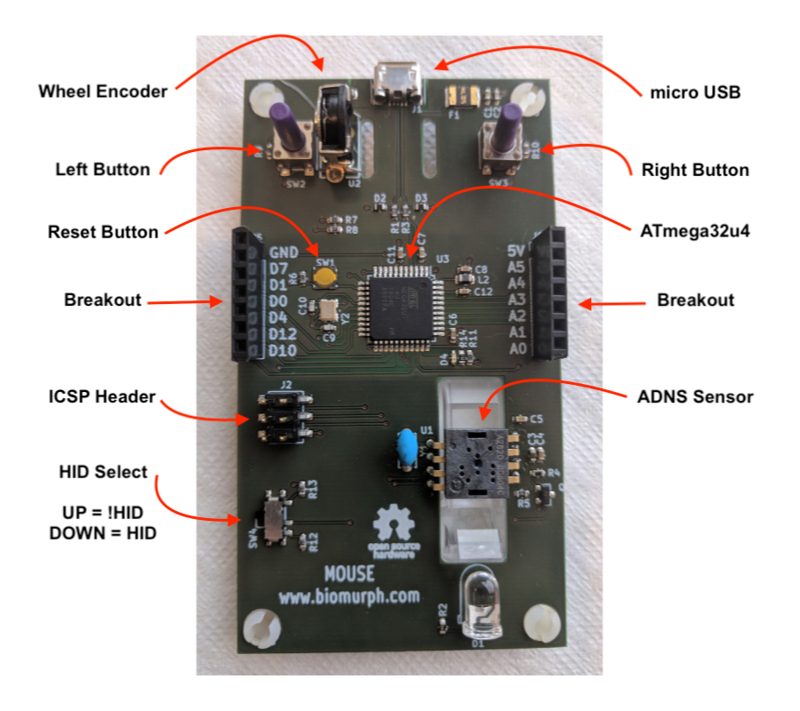

# Mouse
Repository for Open Source Mouse Firmware and Hardware

### What Code To Use?

Install the MouseEye library and use Use Mouse-Test-Buttons-Eye-Wheel.ino which is the prototype for the one-library-to-rule-them-all.

Use the example in the Mousey library to test the one-library-to-rule-them-all

**NOTE:** as of this writing, there is a bug in the Mousey library...

## Anatomy of Mouse

